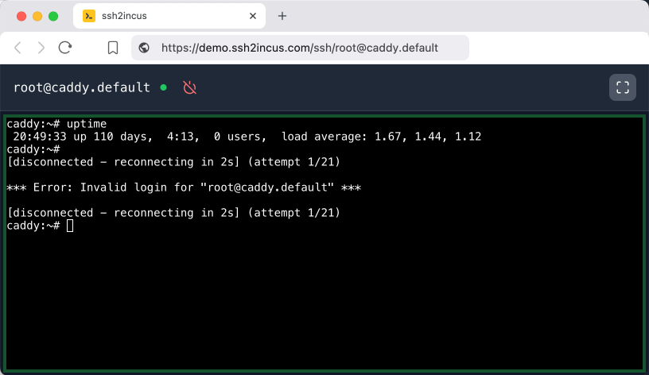
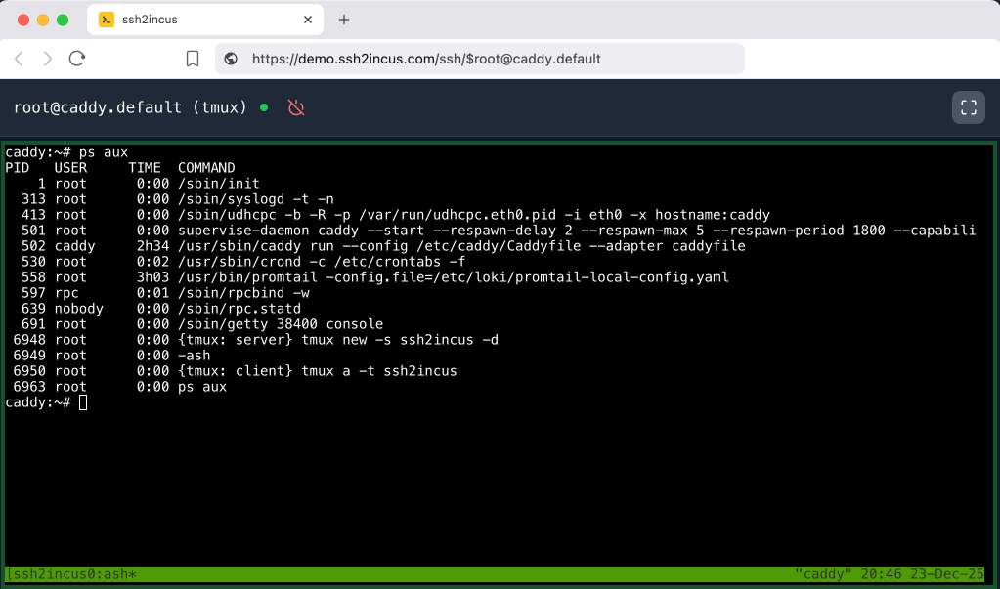
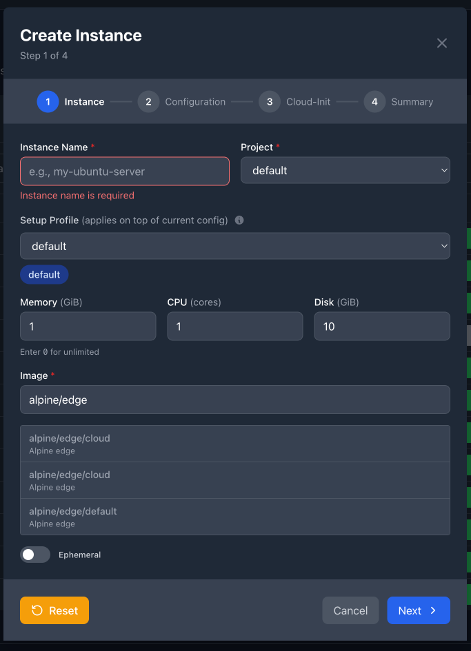
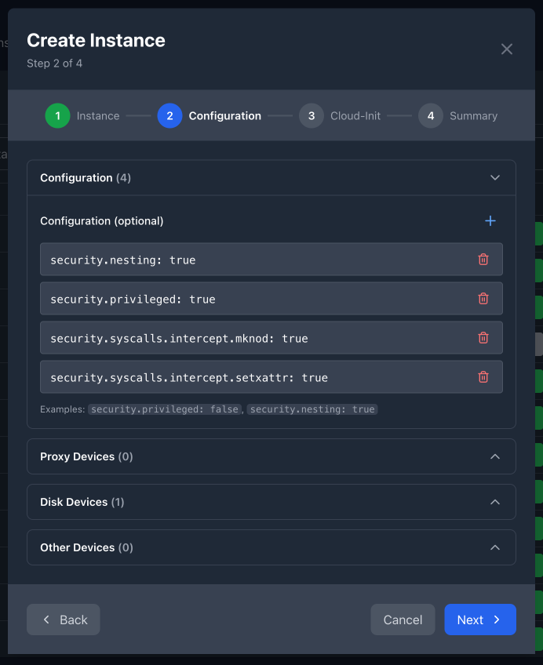
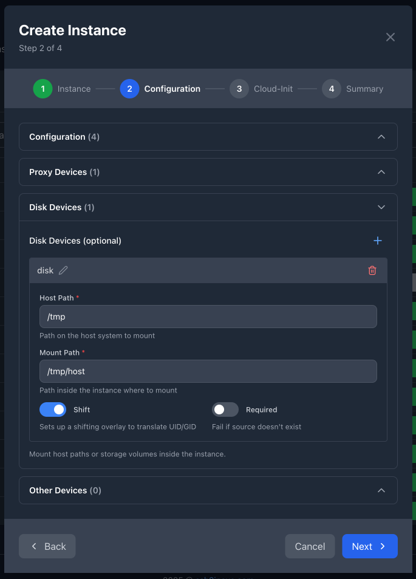
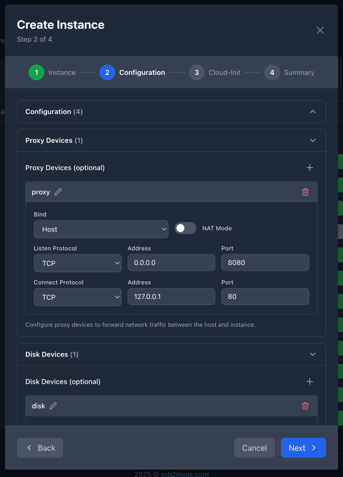
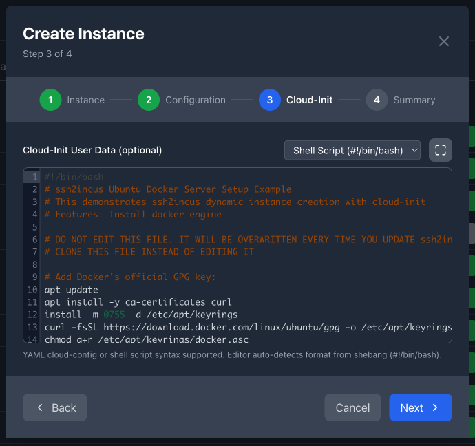
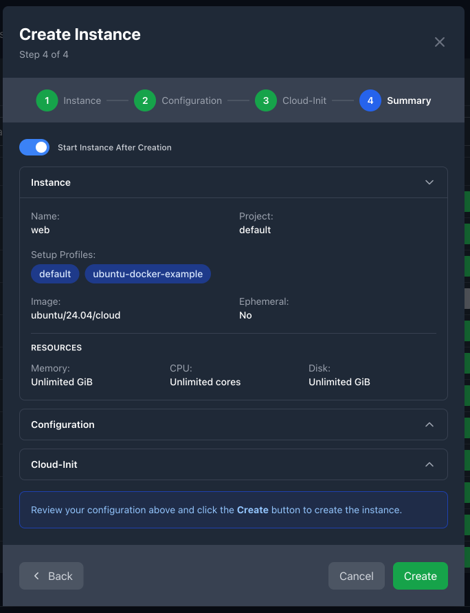
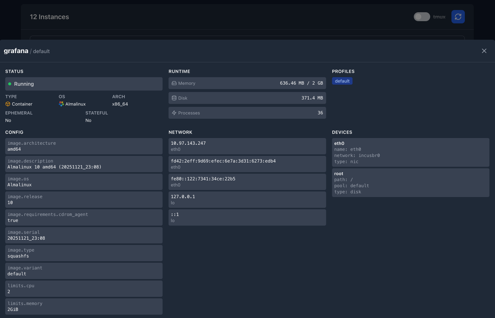

<div align="center">
  
</div>

# ssh2incus – SSH server for Incus instances


_β (beta)_ | Version 0.10 *[changelog](CHANGELOG.md)*

> **Beta notice:** Breaking changes may occur between releases while the project remains in beta. Review the changelog before upgrading.

[ssh2incus](https://ssh2incus.com) provides a full-featured SSH server that connects directly to
[Incus](https://linuxcontainers.org/incus/) containers and virtual machines. It runs on the Incus host
and intelligently routes incoming SSH connections to the appropriate instances using the Incus API, eliminating the
need to run SSH servers inside the instances.

## Features

### Core Features

- **Web-Based User Interface**:
    - Browser-based terminal access to instance shells
    - Auto reconnection to instances after disconnection
    - Web-based instance creation interface with visual configuration builder

- **On-Demand Instance Creation**:
  - Create persistent instances with `+` prefix (e.g., `ssh +test01@host`)
  - Create ephemeral instances with `~` prefix (auto-delete on poweroff)
  - Inline configuration: `ssh +test+ubuntu/24.04+m4+c2+d20+nest+priv@host`
  - Template-based defaults via `create-config.yaml`

- **Instance Management**:
  - Remove instances via `/rm/` or `/remove/` commands (requires root host user)
  - Force removal with `/rm-f/` or `/remove-force/` to skip confirmation
  - Automatic handling of ephemeral instance cleanup
  - Explain login strings with `/explain/` command for troubleshooting

- **Flexible Authentication**:
  - Public key authentication using host SSH keys (default)
  - Password authentication support (`--password-auth`)
  - Instance-based SSH key authentication (`--instance-auth`)
  - Multi-factor authentication chains (`--auth-methods`)
  - No-auth mode for development environments (`--noauth`)
  - NixOS support (checks `/etc/ssh/authorized_keys.d/<user>`)

- **Multiple Remotes**: Connect to any remote from `incus remote list`
- **Terminal Support**: Full PTY (terminal) mode and remote command execution
- **File Transfer**: Complete SCP and SFTP support with integrated SFTP server
- **Port Forwarding**:
    - Local forwarding (`ssh -L`)
    - Reverse forwarding (`ssh -R`)
    - Dynamic forwarding (`ssh -D`)

- **SSH Agent Forwarding**: Seamlessly forward your SSH agent into instance sessions
- **Process Models**:
    - Master process mode: Maintains SSH connections after service restart
    - Daemon mode: Single process with multiple threads for resource-constrained systems

- **Incus Shell**: Manage Incus over SSH

- **Terminal Session Management**:
    - Persistent sessions with `%` prefix (survives SSH disconnections)
    - Terminal multiplexer support (`tmux` or `screen`)
    - Built-in tmux binary deployment for instances without tmux
    - Automatic package installation for missing terminal multiplexers

- **System Integration**:
    - Cross-platform package management (Debian, RHEL, Alpine)
    - Automatic OS detection and package manager selection
    - Instance configuration templates (`create-config.yaml`)
    - Non-root operation support (auto-detects process owner)

- **Compatibility**:
    - Built using Incus 6.20 API
    - Works with Incus inside Lima and Colima
    - Tested with **Jetbrains Gateway**, **VSCode**, **Cursor** and other IDEs
    - Full Ansible support

### Enterprise Features

- Advanced authentication options (SSH keys, passwords, JWT, OpenID, OAuth 2.0, LDAP, etc.)
- Web browser-based terminal access to instance shells
- 24/7 technical support with prioritized feature development

## Screenshots

### Instance Management Dashboard


### Web-Based Terminal


### Persistent Terminal Sessions (tmux)


### Instance Creation Wizard - Step 1


### Instance Creation Wizard - Step 2: Configuration


### Instance Creation Wizard - Step 2: Disk Devices


### Instance Creation Wizard - Step 2: Proxy Devices


### Instance Creation Wizard - Step 3: Cloud-Init


### Instance Creation Wizard - Step 4: Review & Summary


### Instance Details Drawer


## Installation

Download the latest package from the [Releases](https://github.com/mobydeck/ssh2incus/releases) page and install:

### Debian-based Systems (Ubuntu, Debian)

```shell
apt-get install -f ./ssh2incus_0.8-0_amd64.deb
```

### RPM-based Systems (RHEL, Fedora, CentOS, AlmaLinux, Rocky Linux)

```shell
dnf install ./ssh2incus-0.8-0.x86_64.rpm
```

### Service Management

Start and enable the service:

```shell
systemctl enable ssh2incus.service
systemctl start ssh2incus.service
```

Monitor logs:

```shell
journalctl -f -u ssh2incus.service
```

### Web Console Security (Reverse Proxy)

> **Recommendation**: For production deployments, always run the web console behind an SSL-terminated reverse proxy server to ensure encrypted communication and implement additional security controls.

The web console listens on `localhost:2280` by default. For external access, configure a reverse proxy with SSL/TLS termination:

#### Caddy Example

```
https://ssh2incus.mycompany.com {
    reverse_proxy localhost:2280
}
```

#### Nginx Example

```nginx
server {
    listen 443 ssl http2;
    server_name ssh2incus.mycompany.com;

    ssl_certificate /path/to/certificate.crt;
    ssl_certificate_key /path/to/private.key;

    location / {
        proxy_pass http://localhost:2280;
        proxy_http_version 1.1;
        proxy_set_header Upgrade $http_upgrade;
        proxy_set_header Connection "upgrade";
        proxy_set_header Host $host;
        proxy_set_header X-Real-IP $remote_addr;
        proxy_set_header X-Forwarded-For $proxy_add_x_forwarded_for;
        proxy_set_header X-Forwarded-Proto $scheme;
    }
}
```

#### Apache Example

```apache
<VirtualHost *:443>
    ServerName ssh2incus.mycompany.com

    SSLEngine on
    SSLCertificateFile /path/to/certificate.crt
    SSLCertificateKeyFile /path/to/private.key

    ProxyPreserveHost On
    ProxyPass / http://localhost:2280/ upgrade=websocket connection=upgrade
    ProxyPassReverse / http://localhost:2280/
    RequestHeader set X-Forwarded-Proto "https"
    RequestHeader set X-Forwarded-Host "ssh2incus.mycompany.com"
</VirtualHost>
```

## Connection Guide

### Connection Format

To establish an SSH connection to an instance running on Incus host, run:

```shell
ssh -p 2222 [%][remote:][instance-user@]instance-name[.project-name][~host-user]@incus-host
```

For creating new instances on-demand (can be enabled using `--allow-create` flag), use:

```shell
ssh -p 2222 [+|~][remote:]instance-name[.project-name][+%profile1][+%profile2][+image][+memory][+cpu][+disk][+options][~host-user]@incus-host
```

Where:

- `instance-name`: Name of an instance (required)
- `remote`: Remote name from `incus remote list` (optional, defaults to either current remote or remote set via `-r` flag)
- `instance-user`: User in the Incus instance (optional, defaults to `root`)
- `project-name`: Incus project name (optional, defaults to `default`)
- `host-user`: User on the Incus host (optional, defaults to `root`)
- `incus-host`: Hostname or IP address of the Incus host where `ssh2incus` is running (required)

**Special Prefixes:**

- `%`: Use persistent terminal session (tmux/screen) - reconnects to existing session if available
- `+`: Create new persistent instance if it doesn't exist
- `~`: Create new ephemeral instance (deleted on poweroff) if it doesn't exist

**Instance Creation Options** (when using `+` or `~`):

- `%profile`: Apply configuration profile (e.g., `%web-server`, `%database`)
- `image`: Container/VM image (e.g., `ubuntu/24.04`, `alpine/edge`)
- `mN`: Memory in GiB (e.g., `m2` for 2GB, `m4` for 4GB)
- `cN`: CPU cores (e.g., `c2` for 2 cores, `c4` for 4 cores)
- `dN`: Disk size in GiB (e.g., `d10` for 10GB, `d0` for unlimited)
- `nest` or `n`: Enable nested virtualization
- `priv` or `p`: Enable privileged container
- `vm` or `v`: Create VM instead of container

> **Note**: The login string parsing has been significantly improved in v0.8 with enhanced error handling, better validation, and comprehensive test coverage. The parser now handles complex scenarios more reliably while maintaining full backward compatibility with existing login string formats.

### Connection Examples

#### Basic Connection

Connect to existing instance `ubuntu` as `root`:

```shell
ssh -p 2222 ubuntu@1.2.3.4
```

#### Specify Host User

Connect to instance `ubuntu` as root using `admin` on the host:

```shell
ssh -p 2222 ubuntu~admin@1.2.3.4
```

#### Specify Instance User

Connect to instance `ubuntu` as user `ubuntu` using host user `admin`:

```shell
ssh -p 2222 ubuntu@ubuntu~admin@1.2.3.4
```

#### Specify Project

Connect to instance `ubuntu` in `project1` as user `ubuntu`:

```shell
ssh -p 2222 ubuntu@ubuntu.project1@1.2.3.4
```

#### Specify Remote

Connect to instance `ubuntu` in `project1` on remote `incus-prod` as user `ubuntu`:

```shell
ssh -p 2222 incus-prod:ubuntu@ubuntu.project1@1.2.3.4
```

#### Persistent Sessions

Connect to instance with persistent terminal session (survives SSH disconnections):

```shell
ssh -p 2222 %ubuntu@test01@1.2.3.4
```

#### Instance Creation Examples

Create new persistent instance with defaults:

```shell
ssh -p 2222 +test01@1.2.3.4
```

Create ephemeral instance with defaults (deleted on instance poweroff):

```shell
ssh -p 2222 ~test02@1.2.3.4
```

Create Ubuntu 24.04 container with 2GB RAM, 2 CPUs, 10GB disk:

```shell
ssh -p 2222 +test03+ubuntu/24.04+m2+c2+d10@1.2.3.4
```

Create privileged nested container with specific configuration:

```shell
ssh -p 2222 +test04+alpine/edge+m4+c4+d20+nest+priv@1.2.3.4
```

Create ephemeral VM with Ubuntu 24.04:

```shell
ssh -p 2222 ~vm01+ubuntu/24.04+m4+c2+d20+vm@1.2.3.4
```

Create instance in specific project with custom image:

```shell
ssh -p 2222 +test05.myproject+ubuntu/22.04+m2+c1+d15@1.2.3.4
```

Create instance on specific remote:

```shell
ssh -p 2222 +remote1:test06+alpine/edge+m1+c1+d5@1.2.3.4
```

Create instance using configuration profiles:

```shell
ssh -p 2222 +web01+%web-server+%database@1.2.3.4
```

Create instance with multiple profiles and resource overrides:

```shell
ssh -p 2222 +app01+%base+%nodejs+ubuntu/24.04+m8+c4@1.2.3.4
```

**Complex Example**: Create ephemeral privileged nested VM with Ubuntu 24.04, 4GB RAM, 4 CPUs, 20GB disk on remote `prod` in project `testing`:

```shell
ssh -p 2222 ~prod:myvm.testing+ubuntu/24.04+m4+c4+d20+vm+nest+priv@1.2.3.4
```

#### Instance Management

Remove instance with confirmation:

```shell
ssh -p 2222 /rm/test01.default@1.2.3.4
# or
ssh -p 2222 /remove/test01.default@1.2.3.4
```

Force remove without confirmation:

```shell
ssh -p 2222 /rm-f/test01.default@1.2.3.4
# or
ssh -p 2222 /remove-force/test01.default@1.2.3.4
```

#### Login String Explanation

Decode a complex login string to understand its components:

```shell
ssh -p 2222 /explain/%root@myinstance.project1@1.2.3.4
```

Output shows parsed remote, user, instance, project, and instance user details.

## Instance Creation

ssh2incus supports on-demand instance creation through special SSH login syntax. This feature allows you to create and connect to new Incus instances without pre-existing them.

For detailed documentation on advanced configuration options, profiles, and file includes, see the **[Instance Creation Configuration Guide](docs/create-config.md)**.

### Instance Creation Modes

#### Persistent Instances (`+` prefix)

Creates a new persistent instance that will remain available until manually deleted:

```shell
ssh -p 2222 +instance-name@incus-host
```

#### Ephemeral Instances (`~` prefix)

Creates a new ephemeral instance that is automatically deleted when the instance is powered off:

```shell
ssh -p 2222 ~instance-name@incus-host
```

### Configuration Options

Instance creation supports various configuration options specified after the `+` separator:

#### Image Selection
Specify the container/VM image to use:
```shell
ssh -p 2222 +test01+ubuntu/24.04@incus-host
ssh -p 2222 +test02+alpine/edge@incus-host
```

**Note**: For cloud-init support, use images with the `/cloud` suffix:
```shell
ssh -p 2222 +test01+ubuntu/24.04/cloud@incus-host
ssh -p 2222 +test02+alpine/edge/cloud@incus-host
```

#### Profile Configuration
Apply predefined configuration profiles:
```shell
ssh -p 2222 +test01+%web-server@incus-host
ssh -p 2222 +test02+%database+%monitoring@incus-host
```

#### Resource Configuration
- **Memory**: `mN` - Memory in GiB (e.g., `m2`, `m4`, `m8`)
- **CPU**: `cN` - Number of CPU cores (e.g., `c1`, `c2`, `c4`)
- **Disk**: `dN` - Root disk size in GiB (e.g., `d10`, `d20`, `d0` for unlimited)

```shell
ssh -p 2222 +test03+ubuntu/24.04+m4+c2+d20@incus-host
```

#### Advanced Options
- **`nest`** or **`n`**: Enable nested virtualization (for running containers/VMs inside)
- **`priv`** or **`p`**: Enable privileged container (enhanced permissions)
- **`vm`** or **`v`**: Create virtual machine instead of container

```shell
ssh -p 2222 +test04+ubuntu/24.04+m2+c2+d10+nest+priv@incus-host
ssh -p 2222 +vm01+ubuntu/24.04+m4+c4+d30+vm@incus-host
```

### Default Configuration

When no configuration options are specified, instances are created using defaults from `/etc/ssh2incus/create-config.yaml`:

```yaml
version: 1
image: alpine/edge
ephemeral: false
memory: 1          # 1 GiB
cpu: 1             # 1 CPU core
disk: 10           # 10 GiB
vm: false          # Container by default

devices: {}

config:
  security.privileged: false
  security.nested: false
  security.syscalls.intercept.mknod: false
  security.syscalls.intercept.setxattr: false
```

### Instance Creation Behavior

1. **Instance Check**: ssh2incus first checks if the instance already exists
2. **Configuration Resolution**: If creating new instance, resolves configuration in this order:
   - Start with defaults from `create-config.yaml`
   - Apply profiles in order specified (e.g., `%profile1+%profile2`)
   - Override with any direct configuration options (memory, CPU, disk, etc.)
3. **Creation**: Creates new instance with the resolved configuration
4. **Startup**: Starts the instance if it's not already running
5. **Connection**: Establishes SSH connection to the instance

### Lifecycle Management

#### Persistent Instances
- Remain available until manually deleted with `incus delete instance-name`
- Can be stopped/started as needed: `incus stop instance-name`, `incus start instance-name`
- Configuration persists across restarts

#### Ephemeral Instances
- Automatically deleted when powered off from inside the instance: `poweroff`, `shutdown -h now`
- Automatically deleted when powered off by incus: `incus stop instance-name`
- Cannot be restarted once stopped
- Useful for temporary workloads, testing, or CI/CD pipelines

### Use Cases

#### Development and Testing
```shell
# Quick Ubuntu development environment
ssh -p 2222 +dev-env+ubuntu/24.04+m4+c2+d20@incus-host

# Temporary Alpine testing environment
ssh -p 2222 ~test-alpine+alpine/edge+m1+c1+d5@incus-host
```

#### Containerized Applications
```shell
# Docker-enabled environment with nesting
ssh -p 2222 +docker-host+ubuntu/24.04+m8+c4+d50+nest+priv@incus-host
```

#### Virtual Machines
```shell
# Windows-compatible VM environment
ssh -p 2222 +win-compat+ubuntu/24.04+m8+c4+d100+vm@incus-host
```

## Advanced Features

### SSH Agent Forwarding

Enable SSH agent forwarding to use your local SSH keys inside the instance:

1. Start SSH agent locally:
    ```shell
    eval `ssh-agent`
    ```
2. Connect with agent forwarding:
    ```shell
    ssh -A -p 2222 ubuntu@1.2.3.4
    ```

`ssh2incus` automatically creates a proxy socket device in the instance and removes it when the connection closes.

### Password Authentication

Enable password authentication for SSH connections:

```shell
# Enable password authentication
ssh2incus --password-auth

# Or combine with public key auth using method chains
ssh2incus --auth-methods "publickey,password"
```

When password authentication is enabled, `ssh2incus` will verify passwords against the system's user database within the target instance.

### Persistent Terminal Sessions

`ssh2incus` supports persistent terminal sessions using terminal multiplexers. Sessions remain active even when SSH connections are closed.

#### Using tmux (Default)

```shell
# Connect to persistent session (tmux will be automatically installed if missing)
ssh -p 2222 ubuntu@1.2.3.4

# Configure to use tmux explicitly
ssh2incus --term-mux tmux
```

#### Using screen

```shell
# Configure to use screen instead of tmux
ssh2incus --term-mux screen
```

The system automatically:
- Detects if the terminal multiplexer is installed in the instance
- Installs the appropriate package if missing (works across Debian, RHEL, and Alpine)
- For tmux: deploys a built-in static binary if package installation fails
- Creates and manages sessions automatically

### Port Forwarding

#### Local Port Forwarding

Forward local port 8080 to port 80 on the instance:

To forward local port `8080` listening on `127.0.0.1` to port `80` on `ubuntu` instance, run:

```shell
ssh -L 127.0.0.1:8080::80 -p 2222 ubuntu@1.2.3.4
```

#### Reverse Port Forwarding

Forward remote port 3000 on the instance to local port 8080 on your machine:

```shell
ssh -R 127.0.0.1:3000:127.0.0.1:8080 -p 2222 ubuntu@1.2.3.4
```

#### Dynamic Port Forwarding

Dynamic port forwarding sets up a SOCKS5 proxy server through your SSH connection, allowing applications to route
traffic through it regardless of destination port:

```shell
ssh -D 1080 -p 2222 ubuntu@1.2.3.4
```

### Built-in SFTP Server

`ssh2incus` includes a built-in SFTP server that supports standard OpenSSH SFTP server options for secure file transfers.

#### SFTP Server Features

- **CHROOT Support**: Use `--chroot-sftp` flag to enable chrooting SFTP sessions to the user's home directory for enhanced security isolation, except for root users who are not chrooted
- **Custom Start Directory**: SFTP sessions can be configured to start in specific directories
- **Read-Only Mode**: Support for read-only SFTP access when needed
- **Standard Compatibility**: Compatible with standard SFTP clients and OpenSSH SFTP server flags

#### Security Options

Enable SFTP chroot for better security isolation:

```shell
# Enable SFTP chroot to home directory
ssh2incus --chroot-sftp

# This restricts SFTP users to their home directory and subdirectories
```

#### File Transfer Examples

```shell
# Upload files using SCP
scp -P 2222 localfile.txt root@host:/path/to/destination/

# Upload files using SFTP
sftp -P 2222 root@host
sftp> put localfile.txt /path/to/destination/
sftp> quit

# Download files
scp -P 2222 root@host:/path/to/file.txt ./downloaded-file.txt
```

The built-in SFTP server supports all standard SFTP operations including directory navigation, file uploads/downloads, and permission management while providing additional security through chroot capabilities.

### Using Incus Host as SSH Proxy / Bastion

You can access Incus instances through the Incus host acting as an SSH proxy or bastion.
Configure this in your `~/.ssh/config`:

```
Host incus1
  Hostname localhost
  Port 2222
  ProxyJump incus-host

Host incus-host
  Hostname 1.2.3.4
  User root
```

Now connect to the `ubuntu` instance as `root` with:

```shell
ssh ubuntu@incus1
```

> **Security Note**: Using this method provides additional security benefits since port 2222 is
> not exposed to the public internet.

## Server Management

### Process Modes

`ssh2incus` offers two operating modes to suit different environments and requirements:

#### Master Process Mode (Default)

Master process mode employs a primary process that spawns child processes for handling connections. This architecture provides:
- **High Availability**: SSH connections remain active even if the `ssh2incus` service is restarted
- **Fault Isolation**: Issues with one connection don't affect others
- **Resource Management**: Better utilization of system resources for handling many concurrent connections
- **Seamless Updates**: Update the `ssh2incus` service without disrupting active sessions

This is the recommended mode for production environments or systems with sufficient resources.

#### Daemon Mode

Daemon mode runs as a single process with multiple threads, designed for:
- **Low Memory Usage**: Significantly reduced memory footprint
- **Simple Architecture**: Single-process design for embedded or resource-constrained systems
- **Lighter Load**: Better performance on systems with very limited resources

To enable daemon mode, modify `/etc/default/ssh2incus`: remove `-m` from `ARGS=`.

> **Note**: In daemon mode, all active connections will be terminated if the `ssh2incus` service is restarted.

### Incus Shell

The `/shell` command provides direct access to the Incus command line interface from an SSH session,
allowing you to manage your Incus instances without needing to log into the host directly.

Only root is allowed to connect to Incus shell.

This feature is especially useful for:
- Quick management tasks without direct host access
- Systems administration from remote locations

#### Usage

To access the Incus shell, connect using:

```shell
ssh -p 2222 /shell@incus-host
```

#### Features

- Interactive Incus command execution
- Ctrl+C to exit the shell cleanly

#### Example Session

```shell
$ ssh /shell@incus-colima

incus shell emulator on colima-incus (Ctrl+C to exit)

Hit Enter or type 'help <command>' for help about any command

Type incus command:
> incus version
Client version: 6.16
Server version: 6.16

Type incus command:
> incus
```

## Ansible

`ssh2incus` fully supports Ansible automation for container management, making it simple to orchestrate your
Incus instance configuration.

### Ansible Configuration

Create an `ansible.cfg` file with optimized settings for Incus instances:

```
[defaults]
host_key_checking = False
remote_tmp = /tmp/.ansible-${USER}
```

### Inventory Examples

#### Direct Connection

Connect directly to `ssh2incus` on port 2222:

```
[incus1]
# Basic instance connection
instance-a ansible_user=c1 ansible_host=1.2.3.4 ansible_port=2222

# Connection with privilege escalation
instance-b ansible_user=u1@ubuntu ansible_host=1.2.3.4 ansible_port=2222 become=yes
```

#### ProxyJump Connection

Use SSH configuration for a cleaner approach (requires ProxyJump configuration in `~/.ssh/config`):

```
[incus2]
# Basic instance connection
instance-c ansible_user=c1 ansible_host=incus1

# Connection with privilege escalation
instance-d ansible_user=u1@ubuntu ansible_host=incus1 become=yes
```

### Example Playbook

```yaml
---
- hosts: incus1,incus2
  become: no
  become_method: sudo

  tasks:
    - command: env
    - command: ip addr
```

## Configuration

### Default Behavior

By default, `ssh2incus`:

- Listens on port `2222`
- Permits authentication for `root` and members of the `incus`, `incus-admin` groups

To grant a user access permission:

```shell
sudo usermod -aG incus your-host-user
```

### Custom Configuration

`ssh2incus` can be configured in two ways:

1. **Configuration File**: Create a `config.yaml` file in one of these locations (checked in order):
   - Current directory: `./config.yaml`
   - User config directory: `$HOME/.config/ssh2incus/config.yaml`
   - System config directory: `/etc/ssh2incus/config.yaml`

2. **Command Line Flags**: Add configuration flags to the `ARGS=` line in `/etc/default/ssh2incus`

**Note**: Command line flags have higher priority than configuration file options.

#### Configuration File Format

The configuration file uses YAML format with all options commented out by default (using system defaults). Each setting corresponds to a command-line flag:

```yaml
# Listen on ":port" or "host:port" (flag: --listen, -l)
# listen: ":2222"

# Enable debug log (flag: --debug, -d)
# debug: false

# Enable password authentication (flag: --password-auth, -P)
# password-auth: false

# List of groups members of which allowed to connect (flag: --groups, -g)
# groups: "incus,incus-admin"
...
```

Uncomment and modify any options you want to change from their defaults.

### Available Options

```
-C, --allow-create            allow creating new instances
    --auth-methods string     enable auth method chain, e.g.: "publickey,password"
-b, --banner                  show banner on login
    --chroot-sftp             enable home dir chroot for SFTP sessions
-c, --client-cert string      client certificate for remote
-k, --client-key string       client key for remote
-d, --debug                   enable debug log
    --dump                    dump parsed config
    --dump-create             dump parsed create config
-g, --groups string           list of groups members of which allowed to connect (default "incus,incus-admin")
-H, --healthcheck string      enable Incus health check every X minutes, e.g. "5m"
-h, --help                    print help
    --idle-timeout duration   idle session timeout duration, e.g. 180s or 5m (default 3m0s)
    --inauth                  use --instance-auth
-I, --instance-auth           enable authentication using instance keys
-l, --listen string           listen on ":port" or "host:port" (default ":2222")
-m, --master                  start master process and spawn workers
    --noauth                  disable SSH authentication completely
-P, --password-auth           enable password authentication
    --pprof                   enable pprof
    --pprof-listen string     pprof listen on ":port" or "host:port" (default ":6060")
-r, --remote string           default Incus remote to use
-t, --server-cert string      server certificate for remote
-S, --shell string            shell access command: login, su, sush or user shell (default)
-s, --socket string           Incus socket to connect to (optional, defaults to INCUS_SOCKET env)
-T, --term-mux string         terminal multiplexer: tmux (default) or screen (default "tmux")
-u, --url string              Incus remote url to connect to (should start with https://)
-v, --version                 print version
-W, --web                     enable web server
    --web-auth string         enable basic http authentication for web console (comma-separated user:password values)
    --web-listen string       web server listen address (default "127.0.0.1:2280")
-w, --welcome                 show welcome message to users connecting to shell
```

#### Configuration Examples

Enable debug logging and restrict listening to localhost:

```
ARGS=-d -l 127.0.0.1:2222
```

Enable password authentication with public key fallback:

```
ARGS=--auth-methods "publickey,password"
```

Use screen instead of tmux for persistent sessions:

```
ARGS=--term-mux screen
```

Combine multiple options:

```
ARGS=-d --password-auth --term-mux tmux --banner
```

### Banner and Welcome Message Customization

Enable the optional welcome banner with the `-b` flag:

```
┌──────────────────────────────────────────────┐
│          _     ____  _                       │
│  ___ ___| |__ |___ \(_)_ __   ___ _   _ ___  │
│ / __/ __| '_ \  __) | | '_ \ / __| | | / __| │
│ \__ \__ \ | | |/ __/| | | | | (__| |_| \__ \ │
│ |___/___/_| |_|_____|_|_| |_|\___|\__,_|___/ │
└──────────────────────────────────────────────┘
👤 root 📦 a9.default 💻 colima-incus
────────────────────────────────────────────────
```

#### Custom Banner and Welcome Messages

You can customize the SSH banner and welcome messages by creating `banner.txt` and `welcome.txt` files in your configuration directory. The server looks for these files in standard configuration locations.

#### Template Variables

Both banner and welcome message files support template variables that are automatically substituted:

- `[INSTANCE_USER]`: Current instance user name
- `[INSTANCE]`: Instance name
- `[PROJECT]`: Project name
- `[REMOTE]`: Remote server name
- `[HOSTNAME]`: System hostname

#### Example Files

Example banner (`banner.txt.example`):
```
┌──────────────────────────────────────────────┐
│          _     ____  _                       │
│  ___ ___| |__ |___ \(_)_ __   ___ _   _ ___  │
│ / __/ __| '_ \  __) | | '_ \ / __| | | / __| │
│ \__ \__ \ | | |/ __/| | | | | (__| |_| \__ \ │
│ |___/___/_| |_|_____|_|_| |_|\___|\__,_|___/ │
└──────────────────────────────────────────────┘
👤 [INSTANCE_USER] 📦 [INSTANCE].[PROJECT] 💻 [REMOTE]/[HOSTNAME]
────────────────────────────────────────────────
```

Example welcome message (`welcome.txt.example`):
```
Welcome "[INSTANCE_USER]" to incus shell on [INSTANCE].[PROJECT]
```

The banner provides useful context showing:
- Current user (👤)
- Container/VM name and project (📦)
- Remote / host system name (💻)

### Instance Configuration Templates

`ssh2incus` v0.8 supports instance configuration templates via `create-config.yaml` files. These templates provide default settings for on-demand instance creation using the `+` and `~` login prefixes, ensuring consistent instance deployment while allowing customization through the login syntax.

For comprehensive documentation on configuration profiles, file includes, and advanced instance creation workflows, see the **[Instance Creation Configuration Guide](docs/create-config.md)**.

#### Configuration File Location

The system looks for configuration files in these locations (in order):
- `./create-config.yaml` (current working directory)
- `$HOME/.config/ssh2incus/create-config.yaml` (home configuration directory)
- `/etc/ssh2incus/create-config.yaml` (system-wide default)

These templates are automatically used when creating instances with `+` or `~` prefixes. Any options specified in the SSH login string will override the template defaults.

#### Example Configuration

```yaml
# create-config.yaml - Default instance creation template
version: 1
image: alpine/edge          # Default container image
ephemeral: false           # Create persistent instances by default
memory: 1                  # 1 GiB RAM
cpu: 1                     # 1 CPU core
disk: 10                   # 10 GiB root disk
vm: false                  # Container by default

# Instance devices
devices: {}

# Instance configuration
config:
    security.privileged: false                   # Non-privileged by default
    security.nesting: false                      # No nesting by default
    security.syscalls.intercept.mknod: false     # Docker compatibility
    security.syscalls.intercept.setxattr: false  # Docker compatibility
    user.user-data: "!include cloud-init.yaml"   # Load cloud-init from file

# Configuration profiles for different use cases
profiles:
    web-server:
        image: ubuntu/24.04/cloud  # /cloud suffix required for cloud-init
        memory: 2
        cpu: 2
        disk: 20
        config:
            security.nesting: true
            user.user-data: "<@profiles/web-server-init.yaml"

    database:
        image: ubuntu/24.04/cloud  # /cloud suffix required for cloud-init
        memory: 4
        cpu: 2
        disk: 50
        config:
            security.privileged: true
            user.user-data: "!include profiles/database-setup.sh"

    development:
        image: ubuntu/24.04
        memory: 8
        cpu: 4
        disk: 100
        config:
            security.nesting: true
            security.privileged: true
```

#### Template Integration with Instance Creation

The template provides defaults that are automatically applied during instance creation. Configuration options are applied in this order:

1. **Defaults**: Base configuration from the `defaults` section
2. **Profiles**: Applied in order from left to right (later profiles override earlier ones)
3. **Direct Options**: SSH login string options override everything else

```shell
# Uses all template defaults
ssh -p 2222 +test01@incus-host

# Applies web-server profile configuration
ssh -p 2222 +test02+%web-server@incus-host

# Applies both profiles (database settings override web-server where they conflict)
ssh -p 2222 +test03+%web-server+%database@incus-host

# Uses development profile but overrides memory and CPU
ssh -p 2222 +test04+%development+m16+c8@incus-host

# Creates ephemeral instance with profile (overrides template's ephemeral: false)
ssh -p 2222 ~test05+%web-server@incus-host
```

#### File Includes in Configuration

Configuration values support file includes for loading external content:

- `!include filename.ext` - Include file contents as the configuration value
- `<@filename.ext` - Alternative include syntax for file contents

Files are resolved in this order:
1. **Relative to config file directory**: Files in the same directory as `create-config.yaml`
2. **Relative to current working directory**: Fallback to current directory

Example:
```yaml
config:
    user.user-data: "!include cloud-init.yaml"      # Loads ./cloud-init.yaml
    user.meta-data: "<@metadata/instance-info.yaml" # Loads ./metadata/instance-info.yaml
```

This system enables consistent instance deployment across environments while maintaining full flexibility for specific use cases through profiles and the SSH login syntax.

## Firewall Configuration

Since `ssh2incus` listens on port `2222` by default, you'll need to configure your firewall to allow incoming connections on this port.

### Ubuntu/Debian (UFW)

```shell
# Allow SSH access on port 2222
sudo ufw allow 2222/tcp

# Apply changes
sudo ufw reload

# Verify the rule was added
sudo ufw status
```

### RHEL / CentOS / AlmaLinux / Rocky Linux (firewalld)

```shell
# Allow SSH access on port 2222
sudo firewall-cmd --permanent --add-port=2222/tcp

# Apply changes
sudo firewall-cmd --reload

# Verify the rule was added
sudo firewall-cmd --list-ports
```

### Other Firewall Systems

#### iptables (direct)

```shell
sudo iptables -A INPUT -p tcp --dport 2222 -j ACCEPT
sudo iptables-save > /etc/iptables/rules.v4  # Make changes persistent
```

#### nftables

```shell
sudo nft add rule inet filter input tcp dport 2222 accept
sudo nft list ruleset > /etc/nftables.conf  # Make changes persistent
```

### Security Recommendations

For production environments, consider these firewall best practices:
1. **Restrict Access**: Limit access to port 2222 to specific IP addresses or networks
2. **Use SSH Bastion**: Consider exposing `ssh2incus` only to your management network
3. **Rate Limiting**: Implement connection rate limiting to prevent brute force attacks

## Support Options

### Community Support

Get help from the community and developers:

- **Community Board**: Share feedback, feature requests, and ideas on our [community board](https://ask.ssh2incus.com)
  - 🎯 **Feature requests** for additional functionality
  - 🐛 **Bug reports** with reproduction steps
  - 💡 **Ideas** for improving the user experience
  - 📧 **Comments** and feedback on existing features

- **GitHub Issues**: Report bugs, request features, or ask questions through the [GitHub repository](https://github.com/mobydeck/ssh2incus/issues)

- **Documentation**: Refer to the [online documentation](https://ssh2incus.com/documentation) for detailed guides and tutorials

### Enterprise Support

For organizations requiring guaranteed response times and dedicated assistance:
- **Technical Support**: 24/7 access to technical support engineers
- **Priority Bug Fixes**: Expedited resolution of critical issues
- **Feature Development**: Priority implementation of custom requirements
- **Consulting Services**: Implementation guidance and best practices

### Troubleshooting Tips

If you encounter issues with `ssh2incus`:
1. **Check logs**: `journalctl -u ssh2incus.service`
2. **Verify service status**: `systemctl status ssh2incus.service`
3. **Test connectivity**: `telnet incus-host 2222`
4. **Enable debug mode**: Set `-d` flag in `/etc/default/ssh2incus`
5. **Check permissions**: Ensure your host user belongs to the proper groups (`incus` or `incus-admin`)
